<div align="center">

# 🎬 Cinema Booking System
### Admin Panel - Quản Trị Rạp Chiếu Phim


**Hệ thống quản trị toàn diện cho rạp chiếu phim hiện đại**

[✨ Tính năng](#-tính-năng-nổi-bật) • [🚀 Bắt đầu](#-bắt-đầu-nhanh) • [📖 Tài liệu](#-tài-liệu) • [🤝 Đóng góp](#-đóng-góp)


</div>

## 📋 Mục Lục

- [🌟 Giới thiệu](#-giới-thiệu)
- [✨ Tính năng nổi bật](#-tính-năng-nổi-bật)
- [🏗️ Kiến trúc hệ thống](#️-kiến-trúc-hệ-thống)
- [🛠️ Công nghệ sử dụng](#️-công-nghệ-sử-dụng)
- [🚀 Bắt đầu nhanh](#-bắt-đầu-nhanh)
- [📁 Cấu trúc dự án](#-cấu-trúc-dự-án)
- [🔧 Cấu hình nâng cao](#-cấu-hình-nâng-cao)
- [📖 Tài liệu](#-tài-liệu)
- [🧪 Testing](#-testing)
- [🚢 Deployment](#-deployment)
- [🤝 Đóng góp](#-đóng-góp)
- [📞 Liên hệ](#-liên-hệ)

---

## 🌟 Giới Thiệu

**Cinema Admin Panel** là giao diện quản trị hiện đại cho hệ thống đặt vé xem phim trực tuyến. Được thiết kế với trải nghiệm người dùng tối ưu, hệ thống cung cấp đầy đủ công cụ quản lý nghiệp vụ rạp chiếu phim một cách chuyên nghiệp và hiệu quả.

### 🎯 Điểm Nổi Bật

<table>
<tr>
<td width="50%">

#### 💪 Mạnh Mẽ
- Xử lý hàng nghìn giao dịch đồng thời
- Real-time updates với Socket.IO
- Tối ưu hiệu năng cao

</td>
<td width="50%">

#### 🎨 Hiện Đại
- UI/UX thân thiện, trực quan
- Responsive trên mọi thiết bị
- Dark mode support

</td>
</tr>
<tr>
<td width="50%">

#### 🔒 Bảo Mật
- JWT Authentication
- Role-based Access Control
- API Security Best Practices

</td>
<td width="50%">

#### 📊 Thông Minh
- Dashboard analytics chi tiết
- Reports & Export đa dạng
- AI-powered insights (planned)

</td>
</tr>
</table>

---

## ✨ Tính Năng Nổi Bật

<details open>
<summary><b>🎥 Quản Lý Phim</b></summary>

- ✅ CRUD đầy đủ cho phim (Create, Read, Update, Delete)
- ✅ Upload & quản lý media (poster, trailer, gallery)
- ✅ Quản lý metadata (thể loại, tag, rating, cast, crew)
- ✅ Lập lịch chiếu tự động & thủ công
- ✅ Import/Export danh sách phim (Excel, CSV)

</details>

<details>
<summary><b>🏢 Quản Lý Rạp & Phòng Chiếu</b></summary>

- ✅ Quản lý chuỗi rạp đa chi nhánh
- ✅ Cấu hình phòng chiếu với sơ đồ ghế tùy chỉnh
- ✅ Phân loại ghế (Standard, VIP, Couple, Deluxe)
- ✅ Định giá linh hoạt theo loại ghế & khung giờ
- ✅ Bảo trì và lên lịch phòng

</details>

<details>
<summary><b>🎟️ Quản Lý Đặt Vé</b></summary>

- ✅ Xem real-time trạng thái đặt vé
- ✅ Chi tiết booking & lịch sử giao dịch
- ✅ Xử lý hoàn tiền & hủy vé
- ✅ Thống kê tình trạng ghế theo suất
- ✅ WebSocket live updates

</details>

<details>
<summary><b>👥 Quản Lý Người Dùng</b></summary>

- ✅ Quản lý khách hàng & thành viên
- ✅ Hệ thống phân quyền chi tiết (Admin/Manager/Staff)
- ✅ Chương trình membership & điểm tích lũy
- ✅ Lịch sử hoạt động & hành vi người dùng
- ✅ Customer segmentation

</details>

<details>
<summary><b>💳 Thanh Toán & Doanh Thu</b></summary>

- ✅ Dashboard doanh thu real-time
- ✅ Tích hợp đa cổng thanh toán (VNPay, MoMo, ZaloPay)
- ✅ Báo cáo chi tiết theo ngày/tuần/tháng/năm
- ✅ Export Excel, PDF với charts
- ✅ Phân tích xu hướng doanh thu

</details>

<details>
<summary><b>📊 Báo Cáo & Analytics</b></summary>

- ✅ Dashboard tổng quan với real-time data
- ✅ Biểu đồ đa dạng (Line, Bar, Pie, Donut)
- ✅ Top phim, rạp, phòng chiếu
- ✅ Phân tích hành vi khách hàng
- ✅ Predictive analytics (coming soon)

</details>

<details>
<summary><b>🎁 Khuyến Mãi & Marketing</b></summary>

- ✅ Tạo & quản lý mã giảm giá, voucher
- ✅ Chương trình khuyến mãi tự động
- ✅ Quản lý banner, slider, popup
- ✅ Tin tức & blog điện ảnh
- ✅ Email marketing campaigns

</details>

<details>
<summary><b>⚙️ Cấu Hình Hệ Thống</b></summary>

- ✅ Settings tổng thể (logo, branding, contact)
- ✅ Email templates customization
- ✅ SEO & metadata management
- ✅ Database backup & restore
- ✅ System logs & monitoring

</details>

---

## 🏗️ Kiến Trúc Hệ Thống

```mermaid
graph TB
    subgraph "Frontend Layer"
        A[User Website<br/>React.js]
        B[Admin Panel<br/>React.js]
        C[Staff Portal<br/>React.js]
    end
    
    subgraph "Backend Layer"
        D[API Gateway<br/>Laravel]
        E[Socket Service<br/>Node.js + Socket.IO]
    end
    
    subgraph "Data Layer"
        F[(MySQL<br/>Database)]
        G[(Redis<br/>Cache)]
    end
    
    subgraph "External Services"
        H[Payment Gateway<br/>VNPay, MoMo, ZaloPay]
        I[Email Service<br/>SMTP]
        J[Cloud Storage<br/>AWS S3 / Cloudinary]
    end
    
    A -->|REST API| D
    B -->|REST API| D
    C -->|REST API| D
    
    A -.->|WebSocket| E
    B -.->|WebSocket| E
    C -.->|WebSocket| E
    
    D --> F
    D --> G
    E --> G
    
    D --> H
    D --> I
    D --> J
    
    style B fill:#61DAFB,stroke:#333,stroke-width:3px
    style D fill:#FF2D20,stroke:#333,stroke-width:2px
    style E fill:#010101,stroke:#333,stroke-width:2px
```



### 🔄 Data Flow

```
User Action → Component → Redux Action → API Call → Backend
                ↓                                       ↓
         Update State ← Response ← ← ← ← ← ← ← ← ← ← ← ←
                ↓
         Re-render UI
```

---

## 🛠️ Công Nghệ Sử Dụng

### Core Stack

<table>
<tr>
<td align="center" width="20%">

<br><b>React 18</b>
<br><sub>UI Library</sub>
</td>
<td align="center" width="20%">

<br><b>Redux Toolkit</b>
<br><sub>State Management</sub>
</td>
<td align="center" width="20%">

<br><b>Ant Design 5</b>
<br><sub>UI Framework</sub>
</td>
<td align="center" width="20%">

<br><b>Axios</b>
<br><sub>HTTP Client</sub>
</td>
<td align="center" width="20%">

<br><b>Socket.IO</b>
<br><sub>Real-time</sub>
</td>
</tr>
</table>

### Additional Libraries

| Category | Libraries |
|----------|-----------|
| **Routing** | React Router DOM v6 |
| **Charts** | Chart.js, Recharts |
| **Date/Time** | Day.js, Moment.js |
| **Forms** | Formik, Yup |
| **Icons** | React Icons, Ant Design Icons |
| **Styling** | Styled Components, Sass |
| **Utils** | Lodash, classnames |

### Development Tools

| Tool | Purpose |
|------|---------|
| **ESLint** | Code linting & quality |
| **Prettier** | Code formatting |
| **Husky** | Git hooks |
| **Jest + RTL** | Unit & integration testing |
| **Cypress** | E2E testing (optional) |

---

## 🚀 Bắt Đầu Nhanh

### ⚡ Prerequisites

| Requirement | Version |
|-------------|---------|
| Node.js | >= 16.x |
| npm / yarn | >= 8.x / >= 1.22.x |
| RAM | >= 4GB |
| OS | Windows 10+, macOS 10.15+, Linux |

### 📥 Installation

```bash
# 1. Clone repository
git clone https://github.com/your-username/cinema-admin-panel.git
cd cinema-admin-panel

# 2. Install dependencies
npm install
# hoặc
yarn install

# 3. Setup environment
cp .env.example .env

# 4. Start development server
npm start
# hoặc
yarn start

# 🎉 Open http://localhost:3000
```

### 🔐 Default Login Credentials

```
Admin Account:
Email: admin@cinema.com
Password: Admin@123

Manager Account:
Email: manager@cinema.com
Password: Manager@123

Staff Account:
Email: staff@cinema.com
Password: Staff@123
```

---

## 📁 Cấu Trúc Dự Án

```
├── 📁 public
│   ├── 📁 plugins
│   │   ├── 📁 air-datepicker
│   │   ├── 📁 apexcharts
│   │   │   └── 🎨 apexcharts.css
│   │   ├── 📁 bootstrap
│   │   │   ├── 🎨 bootstrap.css
│   │   │   └── 📄 bootstrap.js
│   │   ├── 📁 bootstrap-select
│   │   │   ├── 📁 js
│   │   │   │   ├── 📁 i18n
│   │   │   │   │   ├── 📄 defaults-ar_AR.js
│   │   │   │   │   ├── 📄 defaults-bg_BG.js
│   │   │   │   │   ├── 📄 defaults-cro_CRO.js
│   │   │   │   │   ├── 📄 defaults-cs_CZ.js
│   │   │   │   │   ├── 📄 defaults-da_DK.js
│   │   │   │   │   ├── 📄 defaults-de_DE.js
│   │   │   │   │   ├── 📄 defaults-en_US.js
│   │   │   │   │   ├── 📄 defaults-es_CL.js
│   │   │   │   │   ├── 📄 defaults-es_ES.js
│   │   │   │   │   ├── 📄 defaults-et_EE.js
│   │   │   │   │   ├── 📄 defaults-eu.js
│   │   │   │   │   ├── 📄 defaults-fa_IR.js
│   │   │   │   │   ├── 📄 defaults-fi_FI.js
│   │   │   │   │   ├── 📄 defaults-fr_FR.js
│   │   │   │   │   ├── 📄 defaults-hu_HU.js
│   │   │   │   │   ├── 📄 defaults-id_ID.js
│   │   │   │   │   ├── 📄 defaults-it_IT.js
│   │   │   │   │   ├── 📄 defaults-ja_JP.js
│   │   │   │   │   ├── 📄 defaults-kh_KM.js
│   │   │   │   │   ├── 📄 defaults-ko_KR.js
│   │   │   │   │   ├── 📄 defaults-lt_LT.js
│   │   │   │   │   ├── 📄 defaults-nb_NO.js
│   │   │   │   │   ├── 📄 defaults-nl_NL.js
│   │   │   │   │   ├── 📄 defaults-pl_PL.js
│   │   │   │   │   ├── 📄 defaults-pt_BR.js
│   │   │   │   │   ├── 📄 defaults-pt_PT.js
│   │   │   │   │   ├── 📄 defaults-ro_RO.js
│   │   │   │   │   ├── 📄 defaults-ru_RU.js
│   │   │   │   │   ├── 📄 defaults-sk_SK.js
│   │   │   │   │   ├── 📄 defaults-sl_SI.js
│   │   │   │   │   ├── 📄 defaults-sv_SE.js
│   │   │   │   │   ├── 📄 defaults-tr_TR.js
│   │   │   │   │   ├── 📄 defaults-ua_UA.js
│   │   │   │   │   ├── 📄 defaults-vi_VN.js
│   │   │   │   │   ├── 📄 defaults-zh_CN.js
│   │   │   │   │   └── 📄 defaults-zh_TW.js
│   │   │   │   ├── ⚙️ .jshintrc
│   │   │   │   └── 📄 bootstrap-select.js
│   │   │   ├── 🎨 bootstrap-select.css
│   │   │   ├── 📄 bootstrap-select.js
│   │   │   └── 🌐 test.html
│   │   ├── 📁 bootstrap-tagsinput
│   │   │   ├── 🎨 bootstrap-tagsinput.css
│   │   │   └── 📄 bootstrap-tagsinput.js
│   │   ├── 📁 bootstrap-touchspin
│   │   │   ├── 🎨 jquery.bootstrap-touchspin.css
│   │   │   └── 📄 jquery.bootstrap-touchspin.js
│   │   ├── 📁 bootstrap-wysihtml5-master
│   │   │   ├── 🎨 bootstrap-wysihtml5.css
│   │   │   └── 📄 bootstrap-wysihtml5.js
│   │   ├── 📁 cropperjs
│   │   ├── 📁 datatables
│   │   │   ├── 📁 css
│   │   │   ├── 📁 images
│   │   │   │   ├── 🖼️ sort_asc.png
│   │   │   │   ├── 🖼️ sort_asc_disabled.png
│   │   │   │   ├── 🖼️ sort_both.png
│   │   │   │   ├── 🖼️ sort_desc.png
│   │   │   │   └── 🖼️ sort_desc_disabled.png
│   │   │   └── 📁 js
│   │   │       └── 📄 vfs_fonts.js
│   │   ├── 📁 dropzone
│   │   │   └── 📁 src
│   │   │       ├── 🎨 basic.scss
│   │   │       ├── 🎨 dropzone.css
│   │   │       ├── 📄 dropzone.js
│   │   │       └── 🎨 dropzone.scss
│   │   ├── 📁 fancybox
│   │   ├── 📁 fullcalendar
│   │   │   └── 🎨 fullcalendar.css
│   │   ├── 📁 highcharts-6.0.7
│   │   │   └── 📁 code
│   │   │       ├── 📄 highcharts-3d.js
│   │   │       ├── 📄 highcharts-3d.src.js
│   │   │       ├── 📄 highcharts-more.js
│   │   │       ├── 📄 highcharts-more.src.js
│   │   │       ├── 📄 highcharts.js
│   │   │       └── 📄 highcharts.src.js
│   │   ├── 📁 highlight.js
│   │   │   └── 📁 src
│   │   │       ├── 📁 styles
│   │   │       │   └── 🎨 solarized-dark.css
│   │   │       ├── 📄 highlight.js
│   │   │       └── 📄 highlight.pack.js
│   │   ├── 📁 ion-rangeslider
│   │   │   ├── 📁 css
│   │   │   │   └── 🎨 ion.rangeSlider.css
│   │   │   └── 📁 js
│   │   ├── 📁 jQuery-Knob-master
│   │   ├── 📁 jquery-asColor
│   │   ├── 📁 jquery-asColorPicker
│   │   │   └── 📄 jquery-asColorPicker.js
│   │   ├── 📁 jquery-asGradient
│   │   ├── 📁 jquery-steps
│   │   │   ├── 🎨 jquery.steps.css
│   │   │   └── 📄 jquery.steps.js
│   │   ├── 📁 jvectormap
│   │   │   ├── 🎨 jquery-jvectormap-2.0.3.css
│   │   │   ├── 📄 jquery-jvectormap-world-mill-en.js
│   │   │   ├── 🎨 jquery-jvectormap.css
│   │   │   └── 📄 jquery-jvectormap.js
│   │   ├── 📁 malihu-custom-scrollbar-plugin-master
│   │   │   ├── 🎨 jquery.mCustomScrollbar.css
│   │   │   └── 📄 jquery.mCustomScrollbar.js
│   │   ├── 📁 plyr
│   │   ├── 📁 select2
│   │   ├── 📁 slick
│   │   │   └── 🎨 slick.css
│   │   ├── 📁 sweetalert2
│   │   │   ├── 📄 sweet-alert.init.js
│   │   │   ├── 📄 sweetalert2.all.js
│   │   │   └── 🎨 sweetalert2.css
│   │   ├── 📁 switchery
│   │   ├── 📁 timedropper
│   │   │   ├── 🎨 timedropper.css
│   │   │   └── 📄 timedropper.js
│   │   └── 📁 wysihtml5-master
│   ├── 📁 vendors
│   │   ├── 📁 fonts
│   │   │   ├── 📁 font-awesome
│   │   │   │   └── 📁 css
│   │   │   │       └── 🎨 font-awesome.css
│   │   │   ├── 📁 ionicons-master
│   │   │   │   └── 📁 css
│   │   │   │       └── 🎨 ionicons.css
│   │   │   ├── 📁 themify-icons
│   │   │   │   └── 🎨 themify-icons.css
│   │   │   ├── 📄 FontAwesome.otf
│   │   │   ├── 🎨 dropways.css
│   │   │   ├── 📄 dropways.eot
│   │   │   ├── 🖼️ dropways.svg
│   │   │   ├── 📄 dropways.ttf
│   │   │   ├── 📄 dropways.woff
│   │   │   ├── 📄 fontawesome-webfont.eot
│   │   │   ├── 🖼️ fontawesome-webfont.svg
│   │   │   ├── 📄 fontawesome-webfont.ttf
│   │   │   ├── 📄 fontawesome-webfont.woff
│   │   │   ├── 📄 fontawesome-webfont.woff2
│   │   │   ├── 🎨 foundation-icons.css
│   │   │   ├── 📄 foundation-icons.eot
│   │   │   ├── 🖼️ foundation-icons.svg
│   │   │   ├── 📄 foundation-icons.ttf
│   │   │   ├── 📄 foundation-icons.woff
│   │   │   ├── 📄 ionicons.eot
│   │   │   ├── 🖼️ ionicons.svg
│   │   │   ├── 📄 ionicons.ttf
│   │   │   ├── 📄 ionicons.woff
│   │   │   ├── 📄 themify.eot
│   │   │   ├── 🖼️ themify.svg
│   │   │   ├── 📄 themify.ttf
│   │   │   └── 📄 themify.woff
│   │   ├── 📁 images
│   │   │   ├── 📁 layout
│   │   │   │   ├── 🖼️ header-dark.png
│   │   │   │   ├── 🖼️ header-white.png
│   │   │   │   ├── 🖼️ sidebar-dark.png
│   │   │   │   └── 🖼️ sidebar-white.png
│   │   │   ├── 🖼️ apple-touch-icon.png
│   │   │   ├── 🖼️ banner-img.png
│   │   │   ├── 🖼️ blue-logo.png
│   │   │   ├── 🖼️ briefcase.svg
│   │   │   ├── 🖼️ cancel.svg
│   │   │   ├── 🖼️ caution-sign.png
│   │   │   ├── 🖼️ chat-img1.jpg
│   │   │   ├── 🖼️ chat-img2.jpg
│   │   │   ├── 🖼️ check-mark-green.png
│   │   │   ├── 🖼️ check-mark.png
│   │   │   ├── 🖼️ chrome.png
│   │   │   ├── 🖼️ coming-soon.png
│   │   │   ├── 🖼️ cross.png
│   │   │   ├── 🖼️ demo.svg
│   │   │   ├── 🖼️ deskapp-logo-white.svg
│   │   │   ├── 🖼️ deskapp-logo.svg
│   │   │   ├── 🖼️ edge.png
│   │   │   ├── 🖼️ favicon-16x16.png
│   │   │   ├── 🖼️ favicon-32x32.png
│   │   │   ├── 🖼️ firefox.png
│   │   │   ├── 🖼️ forgot-password.png
│   │   │   ├── 🖼️ github.svg
│   │   │   ├── 🖼️ icon-Cash.png
│   │   │   ├── 🖼️ icon-debit.png
│   │   │   ├── 🖼️ icon-online-wallet.png
│   │   │   ├── 🖼️ img.jpg
│   │   │   ├── 🖼️ img1.jpg
│   │   │   ├── 🖼️ img2.jpg
│   │   │   ├── 🖼️ img3.jpg
│   │   │   ├── 🖼️ img4.jpg
│   │   │   ├── 🖼️ img5.jpg
│   │   │   ├── 🖼️ internet-explorer.png
│   │   │   ├── 🖼️ login-img.png
│   │   │   ├── 🖼️ login-page-img.png
│   │   │   ├── 🖼️ logo-icon.png
│   │   │   ├── 🖼️ menu-icon.svg
│   │   │   ├── 🖼️ modal-img1.jpg
│   │   │   ├── 🖼️ modal-img2.jpg
│   │   │   ├── 🖼️ modal-img3.jpg
│   │   │   ├── 🖼️ new-loader.gif
│   │   │   ├── 🖼️ opera.png
│   │   │   ├── 🖼️ page-icon.svg
│   │   │   ├── 🖼️ person.svg
│   │   │   ├── 🖼️ photo1.jpg
│   │   │   ├── 🖼️ photo2.jpg
│   │   │   ├── 🖼️ photo3.jpg
│   │   │   ├── 🖼️ photo4.jpg
│   │   │   ├── 🖼️ photo5.jpg
│   │   │   ├── 🖼️ photo6.jpg
│   │   │   ├── 🖼️ photo7.jpg
│   │   │   ├── 🖼️ photo8.jpg
│   │   │   ├── 🖼️ photo9.jpg
│   │   │   ├── 🖼️ plyr.svg
│   │   │   ├── 🖼️ product-1.jpg
│   │   │   ├── 🖼️ product-2.jpg
│   │   │   ├── 🖼️ product-3.jpg
│   │   │   ├── 🖼️ product-4.jpg
│   │   │   ├── 🖼️ product-5.jpg
│   │   │   ├── 🖼️ product-img1.jpg
│   │   │   ├── 🖼️ product-img2.jpg
│   │   │   ├── 🖼️ product-img3.jpg
│   │   │   ├── 🖼️ product-img4.jpg
│   │   │   ├── 🖼️ profile-photo.jpg
│   │   │   ├── 🖼️ register-page-img.png
│   │   │   ├── 🖼️ safari.png
│   │   │   ├── 🖼️ success.png
│   │   │   ├── 🖼️ tick.svg
│   │   │   ├── 🖼️ upload-file-img.jpg
│   │   │   └── 🖼️ wave.png
│   │   ├── 📁 scripts
│   │   │   ├── 📄 advanced-components.js
│   │   │   ├── 📄 apexcharts-setting.js
│   │   │   ├── 📄 calendar-setting.js
│   │   │   ├── 📄 colorpicker.js
│   │   │   ├── 📄 core.js
│   │   │   ├── 📄 dashboard.js
│   │   │   ├── 📄 dashboard2.js
│   │   │   ├── 📄 datatable-setting.js
│   │   │   ├── 📄 highchart-setting.js
│   │   │   ├── 📄 jvectormap-setting.js
│   │   │   ├── 📄 knob-chart-setting.js
│   │   │   ├── 📄 layout-settings.js
│   │   │   ├── 📄 process.js
│   │   │   ├── 📄 range-slider-setting.js
│   │   │   ├── 📄 script.js
│   │   │   └── 📄 steps-setting.js
│   │   └── 📁 styles
│   │       ├── 🎨 core.css
│   │       ├── 🎨 icon-font.css
│   │       └── 🎨 style.css
│   ├── 📄 favicon.ico
│   ├── 🌐 index.html
│   ├── 🖼️ logo192.png
│   ├── 🖼️ logo512.png
│   ├── ⚙️ manifest.json
│   └── 📄 robots.txt
├── 📁 src
│   ├── 📁 api
│   │   ├── 📄 AuthApi.js
│   │   ├── 📄 AxiosAdmin.js
│   │   ├── 📄 BannerApi.js
│   │   ├── 📄 CinemasApi.js
│   │   ├── 📄 DistributorApi.js
│   │   ├── 📄 FoodAndDrinkApi.js
│   │   ├── 📄 GenreApi.js
│   │   ├── 📄 MembershipApi.js
│   │   ├── 📄 MovieApi.js
│   │   ├── 📄 MovieCastApi.js
│   │   ├── 📄 MovieGenresApi.js
│   │   ├── 📄 NotificationApi.js
│   │   ├── 📄 OrderApi.js
│   │   ├── 📄 OrderDetailApi.js
│   │   ├── 📄 PromotionApi.js
│   │   ├── 📄 ReviewApi.js
│   │   ├── 📄 RoleApi.js
│   │   ├── 📄 RoomApi (1).js
│   │   ├── 📄 RoomApi.js
│   │   ├── 📄 ScheduleApi.js
│   │   ├── 📄 SeatApi.js
│   │   ├── 📄 ShowtimeApi.js
│   │   ├── 📄 ShowtimeSeatApi.js
│   │   ├── 📄 StaffApi.js
│   │   ├── 📄 TicketApi.js
│   │   ├── 📄 UserApi.js
│   │   └── 📄 WishlistApi.js
│   ├── 📁 assets
│   │   ├── 📁 fonts
│   │   │   ├── 📁 dropways
│   │   │   │   ├── 🎨 dropways.css
│   │   │   │   ├── 📄 dropways.eot
│   │   │   │   ├── 🖼️ dropways.svg
│   │   │   │   ├── 📄 dropways.ttf
│   │   │   │   └── 📄 dropways.woff
│   │   │   ├── 📁 font-awesome
│   │   │   │   ├── 📁 css
│   │   │   │   │   └── 🎨 font-awesome.css
│   │   │   │   └── 📁 fonts
│   │   │   │       ├── 📄 FontAwesome.otf
│   │   │   │       ├── 📄 fontawesome-webfont.eot
│   │   │   │       ├── 🖼️ fontawesome-webfont.svg
│   │   │   │       ├── 📄 fontawesome-webfont.ttf
│   │   │   │       ├── 📄 fontawesome-webfont.woff
│   │   │   │       └── 📄 fontawesome-webfont.woff2
│   │   │   ├── 📁 foundation-icons
│   │   │   │   ├── 🎨 foundation-icons.css
│   │   │   │   ├── 📄 foundation-icons.eot
│   │   │   │   ├── 🖼️ foundation-icons.svg
│   │   │   │   ├── 📄 foundation-icons.ttf
│   │   │   │   └── 📄 foundation-icons.woff
│   │   │   ├── 📁 ionicons-master
│   │   │   │   ├── 📁 css
│   │   │   │   │   └── 🎨 ionicons.css
│   │   │   │   └── 📁 fonts
│   │   │   │       ├── 📄 ionicons.eot
│   │   │   │       ├── 🖼️ ionicons.svg
│   │   │   │       ├── 📄 ionicons.ttf
│   │   │   │       └── 📄 ionicons.woff
│   │   │   └── 📁 themify-icons
│   │   │       ├── 📁 fonts
│   │   │       │   ├── 📄 themify.eot
│   │   │       │   ├── 🖼️ themify.svg
│   │   │       │   ├── 📄 themify.ttf
│   │   │       │   └── 📄 themify.woff
│   │   │       └── 🎨 themify-icons.css
│   │   ├── 📁 icons
│   │   ├── 📁 images
│   │   │   ├── 📁 layout
│   │   │   │   ├── 🖼️ header-dark.png
│   │   │   │   ├── 🖼️ header-white.png
│   │   │   │   ├── 🖼️ sidebar-dark.png
│   │   │   │   └── 🖼️ sidebar-white.png
│   │   │   ├── 🖼️ apple-touch-icon.png
│   │   │   ├── 🖼️ banner-img.png
│   │   │   ├── 🖼️ bannergau2.png
│   │   │   ├── 🖼️ briefcase.svg
│   │   │   ├── 🖼️ cancel.svg
│   │   │   ├── 🖼️ caution-sign.png
│   │   │   ├── 🖼️ chat-img1.jpg
│   │   │   ├── 🖼️ chat-img2.jpg
│   │   │   ├── 🖼️ check-mark-green.png
│   │   │   ├── 🖼️ check-mark.png
│   │   │   ├── 🖼️ chrome.png
│   │   │   ├── 🖼️ coming-soon.png
│   │   │   ├── 🖼️ cross.png
│   │   │   ├── 🖼️ demo.svg
│   │   │   ├── 🖼️ deskapp-logo-white.svg
│   │   │   ├── 🖼️ deskapp-logo.svg
│   │   │   ├── 🖼️ edge.png
│   │   │   ├── 🖼️ favicon-16x16.png
│   │   │   ├── 🖼️ favicon-32x32.png
│   │   │   ├── 🖼️ firefox.png
│   │   │   ├── 🖼️ forgot-password.png
│   │   │   ├── 🖼️ github.svg
│   │   │   ├── 🖼️ icon-Cash.png
│   │   │   ├── 🖼️ icon-debit.png
│   │   │   ├── 🖼️ icon-online-wallet.png
│   │   │   ├── 🖼️ img.jpg
│   │   │   ├── 🖼️ img1.jpg
│   │   │   ├── 🖼️ img2.jpg
│   │   │   ├── 🖼️ img3.jpg
│   │   │   ├── 🖼️ img4.jpg
│   │   │   ├── 🖼️ img5.jpg
│   │   │   ├── 🖼️ internet-explorer.png
│   │   │   ├── 🖼️ login-page-img.png
│   │   │   ├── 🖼️ logo-icon.png
│   │   │   ├── 🖼️ menu-icon.svg
│   │   │   ├── 🖼️ modal-img1.jpg
│   │   │   ├── 🖼️ modal-img2.jpg
│   │   │   ├── 🖼️ modal-img3.jpg
│   │   │   ├── 🖼️ new-loader.gif
│   │   │   ├── 🖼️ opera.png
│   │   │   ├── 🖼️ page-icon.svg
│   │   │   ├── 🖼️ person.svg
│   │   │   ├── 🖼️ photo1.jpg
│   │   │   ├── 🖼️ photo2.jpg
│   │   │   ├── 🖼️ photo3.jpg
│   │   │   ├── 🖼️ photo4.jpg
│   │   │   ├── 🖼️ photo5.jpg
│   │   │   ├── 🖼️ photo6.jpg
│   │   │   ├── 🖼️ photo7.jpg
│   │   │   ├── 🖼️ photo8.jpg
│   │   │   ├── 🖼️ photo9.jpg
│   │   │   ├── 🖼️ plyr.svg
│   │   │   ├── 🖼️ product-1.jpg
│   │   │   ├── 🖼️ product-2.jpg
│   │   │   ├── 🖼️ product-3.jpg
│   │   │   ├── 🖼️ product-4.jpg
│   │   │   ├── 🖼️ product-5.jpg
│   │   │   ├── 🖼️ product-img1.jpg
│   │   │   ├── 🖼️ product-img2.jpg
│   │   │   ├── 🖼️ product-img3.jpg
│   │   │   ├── 🖼️ product-img4.jpg
│   │   │   ├── 🖼️ profile-photo.jpg
│   │   │   ├── 🖼️ register-page-img.png
│   │   │   ├── 🖼️ safari.png
│   │   │   ├── 🖼️ success.png
│   │   │   ├── 🖼️ tick.svg
│   │   │   ├── 🖼️ upload-file-img.jpg
│   │   │   └── 🖼️ wave.png
│   │   ├── 📁 plugins
│   │   │   ├── 📁 air-datepicker
│   │   │   ├── 📁 apexcharts
│   │   │   │   └── 🎨 apexcharts.css
│   │   │   ├── 📁 bootstrap
│   │   │   │   ├── 🎨 bootstrap.css
│   │   │   │   └── 📄 bootstrap.js
│   │   │   ├── 📁 bootstrap-select
│   │   │   │   ├── 📁 js
│   │   │   │   │   ├── 📁 i18n
│   │   │   │   │   │   ├── 📄 defaults-ar_AR.js
│   │   │   │   │   │   ├── 📄 defaults-bg_BG.js
│   │   │   │   │   │   ├── 📄 defaults-cro_CRO.js
│   │   │   │   │   │   ├── 📄 defaults-cs_CZ.js
│   │   │   │   │   │   ├── 📄 defaults-da_DK.js
│   │   │   │   │   │   ├── 📄 defaults-de_DE.js
│   │   │   │   │   │   ├── 📄 defaults-en_US.js
│   │   │   │   │   │   ├── 📄 defaults-es_CL.js
│   │   │   │   │   │   ├── 📄 defaults-es_ES.js
│   │   │   │   │   │   ├── 📄 defaults-et_EE.js
│   │   │   │   │   │   ├── 📄 defaults-eu.js
│   │   │   │   │   │   ├── 📄 defaults-fa_IR.js
│   │   │   │   │   │   ├── 📄 defaults-fi_FI.js
│   │   │   │   │   │   ├── 📄 defaults-fr_FR.js
│   │   │   │   │   │   ├── 📄 defaults-hu_HU.js
│   │   │   │   │   │   ├── 📄 defaults-id_ID.js
│   │   │   │   │   │   ├── 📄 defaults-it_IT.js
│   │   │   │   │   │   ├── 📄 defaults-ja_JP.js
│   │   │   │   │   │   ├── 📄 defaults-kh_KM.js
│   │   │   │   │   │   ├── 📄 defaults-ko_KR.js
│   │   │   │   │   │   ├── 📄 defaults-lt_LT.js
│   │   │   │   │   │   ├── 📄 defaults-nb_NO.js
│   │   │   │   │   │   ├── 📄 defaults-nl_NL.js
│   │   │   │   │   │   ├── 📄 defaults-pl_PL.js
│   │   │   │   │   │   ├── 📄 defaults-pt_BR.js
│   │   │   │   │   │   ├── 📄 defaults-pt_PT.js
│   │   │   │   │   │   ├── 📄 defaults-ro_RO.js
│   │   │   │   │   │   ├── 📄 defaults-ru_RU.js
│   │   │   │   │   │   ├── 📄 defaults-sk_SK.js
│   │   │   │   │   │   ├── 📄 defaults-sl_SI.js
│   │   │   │   │   │   ├── 📄 defaults-sv_SE.js
│   │   │   │   │   │   ├── 📄 defaults-tr_TR.js
│   │   │   │   │   │   ├── 📄 defaults-ua_UA.js
│   │   │   │   │   │   ├── 📄 defaults-vi_VN.js
│   │   │   │   │   │   ├── 📄 defaults-zh_CN.js
│   │   │   │   │   │   └── 📄 defaults-zh_TW.js
│   │   │   │   │   ├── ⚙️ .jshintrc
│   │   │   │   │   └── 📄 bootstrap-select.js
│   │   │   │   ├── 🎨 bootstrap-select.css
│   │   │   │   ├── 📄 bootstrap-select.js
│   │   │   │   └── 🌐 test.html
│   │   │   ├── 📁 bootstrap-tagsinput
│   │   │   │   ├── 🎨 bootstrap-tagsinput.css
│   │   │   │   └── 📄 bootstrap-tagsinput.js
│   │   │   ├── 📁 bootstrap-touchspin
│   │   │   │   ├── 🎨 jquery.bootstrap-touchspin.css
│   │   │   │   └── 📄 jquery.bootstrap-touchspin.js
│   │   │   ├── 📁 bootstrap-wysihtml5-master
│   │   │   │   ├── 🎨 bootstrap-wysihtml5.css
│   │   │   │   └── 📄 bootstrap-wysihtml5.js
│   │   │   ├── 📁 cropperjs
│   │   │   ├── 📁 datatables
│   │   │   │   ├── 📁 css
│   │   │   │   ├── 📁 images
│   │   │   │   │   ├── 🖼️ sort_asc.png
│   │   │   │   │   ├── 🖼️ sort_asc_disabled.png
│   │   │   │   │   ├── 🖼️ sort_both.png
│   │   │   │   │   ├── 🖼️ sort_desc.png
│   │   │   │   │   └── 🖼️ sort_desc_disabled.png
│   │   │   │   └── 📁 js
│   │   │   │       └── 📄 vfs_fonts.js
│   │   │   ├── 📁 dropzone
│   │   │   │   └── 📁 src
│   │   │   │       ├── 🎨 basic.scss
│   │   │   │       ├── 🎨 dropzone.css
│   │   │   │       ├── 📄 dropzone.js
│   │   │   │       └── 🎨 dropzone.scss
│   │   │   ├── 📁 fancybox
│   │   │   ├── 📁 fullcalendar
│   │   │   │   └── 🎨 fullcalendar.css
│   │   │   ├── 📁 highcharts-6.0.7
│   │   │   │   └── 📁 code
│   │   │   │       ├── 📄 highcharts-3d.js
│   │   │   │       ├── 📄 highcharts-3d.src.js
│   │   │   │       ├── 📄 highcharts-more.js
│   │   │   │       ├── 📄 highcharts-more.src.js
│   │   │   │       ├── 📄 highcharts.js
│   │   │   │       └── 📄 highcharts.src.js
│   │   │   ├── 📁 highlight.js
│   │   │   │   └── 📁 src
│   │   │   │       ├── 📁 styles
│   │   │   │       │   └── 🎨 solarized-dark.css
│   │   │   │       ├── 📄 highlight.js
│   │   │   │       └── 📄 highlight.pack.js
│   │   │   ├── 📁 ion-rangeslider
│   │   │   │   ├── 📁 css
│   │   │   │   │   └── 🎨 ion.rangeSlider.css
│   │   │   │   └── 📁 js
│   │   │   ├── 📁 jQuery-Knob-master
│   │   │   ├── 📁 jquery-asColor
│   │   │   ├── 📁 jquery-asColorPicker
│   │   │   │   └── 📄 jquery-asColorPicker.js
│   │   │   ├── 📁 jquery-asGradient
│   │   │   ├── 📁 jquery-steps
│   │   │   │   ├── 🎨 jquery.steps.css
│   │   │   │   └── 📄 jquery.steps.js
│   │   │   ├── 📁 jvectormap
│   │   │   │   ├── 🎨 jquery-jvectormap-2.0.3.css
│   │   │   │   ├── 📄 jquery-jvectormap-world-mill-en.js
│   │   │   │   ├── 🎨 jquery-jvectormap.css
│   │   │   │   └── 📄 jquery-jvectormap.js
│   │   │   ├── 📁 malihu-custom-scrollbar-plugin-master
│   │   │   │   ├── 🎨 jquery.mCustomScrollbar.css
│   │   │   │   └── 📄 jquery.mCustomScrollbar.js
│   │   │   ├── 📁 plyr
│   │   │   ├── 📁 select2
│   │   │   ├── 📁 slick
│   │   │   │   └── 🎨 slick.css
│   │   │   ├── 📁 sweetalert2
│   │   │   │   ├── 📄 sweet-alert.init.js
│   │   │   │   ├── 📄 sweetalert2.all.js
│   │   │   │   └── 🎨 sweetalert2.css
│   │   │   ├── 📁 switchery
│   │   │   ├── 📁 timedropper
│   │   │   │   ├── 🎨 timedropper.css
│   │   │   │   └── 📄 timedropper.js
│   │   │   └── 📁 wysihtml5-master
│   │   ├── 📁 scripts
│   │   │   ├── 📄 moment.js
│   │   │   └── 📄 setting.js
│   │   └── 📁 styles
│   │       ├── 🎨 media.css
│   │       ├── 🎨 style.css
│   │       └── 🎨 theme.css
│   ├── 📁 components
│   │   ├── 📁 common
│   │   └── 📁 ui
│   ├── 📁 config
│   ├── 📁 constants
│   ├── 📁 contexts
│   ├── 📁 hooks
│   ├── 📁 layouts
│   │   ├── 📄 Footer.js
│   │   ├── 📄 Header.js
│   │   ├── 📄 Loader.js
│   │   └── 📄 MainLayout.js
│   ├── 📁 pages
│   │   ├── 📁 Banner
│   │   │   ├── 📄 delete.js
│   │   │   ├── 📄 edit.js
│   │   │   ├── 📄 index.js
│   │   │   └── 📄 show.js
│   │   ├── 📁 Cinemas
│   │   │   ├── 📄 delete.js
│   │   │   ├── 📄 edit.js
│   │   │   ├── 📄 index.js
│   │   │   └── 📄 show.js
│   │   ├── 📁 Distributor
│   │   │   ├── 📄 delete.js
│   │   │   ├── 📄 edit.js
│   │   │   ├── 📄 index.js
│   │   │   └── 📄 show.js
│   │   ├── 📁 Genres
│   │   │   ├── 📄 delete.js
│   │   │   ├── 📄 edit.js
│   │   │   ├── 📄 index.js
│   │   │   └── 📄 show.js
│   │   ├── 📁 Membership
│   │   │   ├── 📄 delete.js
│   │   │   ├── 📄 edit.js
│   │   │   ├── 📄 index.js
│   │   │   └── 📄 show.js
│   │   ├── 📁 Movie
│   │   │   ├── 📄 delete.js
│   │   │   ├── 📄 edit.js
│   │   │   ├── 📄 index.js
│   │   │   └── 📄 show.js
│   │   ├── 📁 MovieCast
│   │   │   ├── 📄 delete.js
│   │   │   ├── 📄 edit.js
│   │   │   ├── 📄 index.js
│   │   │   └── 📄 show.js
│   │   ├── 📁 MovieGenres
│   │   │   ├── 📄 delete.js
│   │   │   ├── 📄 edit.js
│   │   │   ├── 📄 index.js
│   │   │   └── 📄 show.js
│   │   ├── 📁 Notifications
│   │   │   ├── 📄 delete.js
│   │   │   ├── 📄 edit.js
│   │   │   ├── 📄 index.js
│   │   │   └── 📄 show.js
│   │   ├── 📁 Order
│   │   │   ├── 📄 delete.js
│   │   │   ├── 📄 edit.js
│   │   │   ├── 📄 index.js
│   │   │   └── 📄 show.js
│   │   ├── 📁 OrderDetail
│   │   │   ├── 📄 delete.js
│   │   │   ├── 📄 edit.js
│   │   │   ├── 📄 index.js
│   │   │   └── 📄 show.js
│   │   ├── 📁 Promotions
│   │   │   ├── 📄 delete.js
│   │   │   ├── 📄 edit.js
│   │   │   ├── 📄 index.js
│   │   │   └── 📄 show.js
│   │   ├── 📁 Review
│   │   │   ├── 📄 delete.js
│   │   │   ├── 📄 edit.js
│   │   │   ├── 📄 index.js
│   │   │   └── 📄 show.js
│   │   ├── 📁 Role
│   │   │   ├── 📄 delete.js
│   │   │   ├── 📄 edit.js
│   │   │   ├── 📄 index.js
│   │   │   └── 📄 show.js
│   │   ├── 📁 Room
│   │   │   ├── 📄 delete.js
│   │   │   ├── 📄 edit.js
│   │   │   ├── 📄 index.js
│   │   │   └── 📄 show.js
│   │   ├── 📁 Schedule
│   │   │   ├── 📄 delete.js
│   │   │   ├── 📄 edit.js
│   │   │   ├── 📄 index.js
│   │   │   └── 📄 show.js
│   │   ├── 📁 Showtime
│   │   │   ├── 📄 delete.js
│   │   │   ├── 📄 edit.js
│   │   │   ├── 📄 index.js
│   │   │   └── 📄 show.js
│   │   ├── 📁 ShowtimeSeats
│   │   │   ├── 📄 delete.js
│   │   │   ├── 📄 edit.js
│   │   │   ├── 📄 index.js
│   │   │   └── 📄 show.js
│   │   ├── 📁 Staff
│   │   │   ├── 📄 delete.js
│   │   │   ├── 📄 edit.js
│   │   │   ├── 📄 index.js
│   │   │   └── 📄 show.js
│   │   ├── 📁 Ticket
│   │   │   ├── 📄 delete.js
│   │   │   ├── 📄 edit.js
│   │   │   ├── 📄 index.js
│   │   │   └── 📄 show.js
│   │   ├── 📁 User
│   │   │   ├── 📄 delete.js
│   │   │   ├── 📄 edit.js
│   │   │   ├── 📄 index.js
│   │   │   └── 📄 show.js
│   │   ├── 📁 Wishlist
│   │   │   ├── 📄 delete.js
│   │   │   ├── 📄 edit.js
│   │   │   ├── 📄 index.js
│   │   │   └── 📄 show.js
│   │   ├── 📄 home.js
│   │   ├── 📄 home2.js
│   │   ├── 📄 login.js
│   │   ├── 📄 logout.js
│   │   ├── 📄 profile.js
│   │   └── 📄 register.js
│   ├── 📁 routes
│   │   ├── 📄 AdminRoutes.js
│   │   └── 📄 PrivateRoute.js
│   ├── 📁 store
│   ├── 📁 styles
│   │   ├── 📁 Role
│   │   │   ├── 🎨 Edit.css
│   │   │   └── 🎨 Show.css
│   │   ├── 📁 wishlist
│   │   │   └── 🎨 Show.css
│   │   ├── 🎨 Edit.css
│   │   ├── 🎨 Show.css
│   │   └── 🎨 User.css
│   ├── 📁 utils
│   │   └── 📄 auth.js
│   ├── 📁 vendors
│   │   ├── 📁 fonts
│   │   │   ├── 📁 font-awesome
│   │   │   │   └── 📁 css
│   │   │   │       └── 🎨 font-awesome.css
│   │   │   ├── 📁 ionicons-master
│   │   │   │   └── 📁 css
│   │   │   │       └── 🎨 ionicons.css
│   │   │   ├── 📁 themify-icons
│   │   │   │   └── 🎨 themify-icons.css
│   │   │   ├── 📄 FontAwesome.otf
│   │   │   ├── 🎨 dropways.css
│   │   │   ├── 📄 dropways.eot
│   │   │   ├── 🖼️ dropways.svg
│   │   │   ├── 📄 dropways.ttf
│   │   │   ├── 📄 dropways.woff
│   │   │   ├── 📄 fontawesome-webfont.eot
│   │   │   ├── 🖼️ fontawesome-webfont.svg
│   │   │   ├── 📄 fontawesome-webfont.ttf
│   │   │   ├── 📄 fontawesome-webfont.woff
│   │   │   ├── 📄 fontawesome-webfont.woff2
│   │   │   ├── 🎨 foundation-icons.css
│   │   │   ├── 📄 foundation-icons.eot
│   │   │   ├── 🖼️ foundation-icons.svg
│   │   │   ├── 📄 foundation-icons.ttf
│   │   │   ├── 📄 foundation-icons.woff
│   │   │   ├── 📄 ionicons.eot
│   │   │   ├── 🖼️ ionicons.svg
│   │   │   ├── 📄 ionicons.ttf
│   │   │   ├── 📄 ionicons.woff
│   │   │   ├── 📄 themify.eot
│   │   │   ├── 🖼️ themify.svg
│   │   │   ├── 📄 themify.ttf
│   │   │   └── 📄 themify.woff
│   │   ├── 📁 images
│   │   │   ├── 📁 layout
│   │   │   │   ├── 🖼️ header-dark.png
│   │   │   │   ├── 🖼️ header-white.png
│   │   │   │   ├── 🖼️ sidebar-dark.png
│   │   │   │   └── 🖼️ sidebar-white.png
│   │   │   ├── 🖼️ apple-touch-icon.png
│   │   │   ├── 🖼️ banner-img.png
│   │   │   ├── 🖼️ bannergau.png
│   │   │   ├── 🖼️ bannergau21.png
│   │   │   ├── 🖼️ blue-logo.png
│   │   │   ├── 🖼️ briefcase.svg
│   │   │   ├── 🖼️ cancel.svg
│   │   │   ├── 🖼️ caution-sign.png
│   │   │   ├── 🖼️ chat-img1.jpg
│   │   │   ├── 🖼️ chat-img2.jpg
│   │   │   ├── 🖼️ check-mark-green.png
│   │   │   ├── 🖼️ check-mark.png
│   │   │   ├── 🖼️ chrome.png
│   │   │   ├── 🖼️ coming-soon.png
│   │   │   ├── 🖼️ cross.png
│   │   │   ├── 🖼️ demo.svg
│   │   │   ├── 🖼️ deskapp-logo-white.svg
│   │   │   ├── 🖼️ deskapp-logo.svg
│   │   │   ├── 🖼️ edge.png
│   │   │   ├── 🖼️ favicon-16x16.png
│   │   │   ├── 🖼️ favicon-32x32.png
│   │   │   ├── 🖼️ firefox.png
│   │   │   ├── 🖼️ forgot-password.png
│   │   │   ├── 🖼️ gau1.jpg
│   │   │   ├── 🖼️ github.svg
│   │   │   ├── 🖼️ icon-Cash.png
│   │   │   ├── 🖼️ icon-debit.png
│   │   │   ├── 🖼️ icon-online-wallet.png
│   │   │   ├── 🖼️ img.jpg
│   │   │   ├── 🖼️ img1.jpg
│   │   │   ├── 🖼️ img2.jpg
│   │   │   ├── 🖼️ img3.jpg
│   │   │   ├── 🖼️ img4.jpg
│   │   │   ├── 🖼️ img5.jpg
│   │   │   ├── 🖼️ internet-explorer.png
│   │   │   ├── 🖼️ login-img.png
│   │   │   ├── 🖼️ login-page-img.png
│   │   │   ├── 🖼️ logo-icon.png
│   │   │   ├── 🖼️ menu-icon.svg
│   │   │   ├── 🖼️ modal-img1.jpg
│   │   │   ├── 🖼️ modal-img2.jpg
│   │   │   ├── 🖼️ modal-img3.jpg
│   │   │   ├── 🖼️ new-loader.gif
│   │   │   ├── 🖼️ opera.png
│   │   │   ├── 🖼️ page-icon.svg
│   │   │   ├── 🖼️ person.svg
│   │   │   ├── 🖼️ photo1.jpg
│   │   │   ├── 🖼️ photo2.jpg
│   │   │   ├── 🖼️ photo3.jpg
│   │   │   ├── 🖼️ photo4.jpg
│   │   │   ├── 🖼️ photo5.jpg
│   │   │   ├── 🖼️ photo6.jpg
│   │   │   ├── 🖼️ photo7.jpg
│   │   │   ├── 🖼️ photo8.jpg
│   │   │   ├── 🖼️ photo9.jpg
│   │   │   ├── 🖼️ plyr.svg
│   │   │   ├── 🖼️ product-1.jpg
│   │   │   ├── 🖼️ product-2.jpg
│   │   │   ├── 🖼️ product-3.jpg
│   │   │   ├── 🖼️ product-4.jpg
│   │   │   ├── 🖼️ product-5.jpg
│   │   │   ├── 🖼️ product-img1.jpg
│   │   │   ├── 🖼️ product-img2.jpg
│   │   │   ├── 🖼️ product-img3.jpg
│   │   │   ├── 🖼️ product-img4.jpg
│   │   │   ├── 🖼️ profile-photo.jpg
│   │   │   ├── 🖼️ register-page-img.png
│   │   │   ├── 🖼️ safari.png
│   │   │   ├── 🖼️ success.png
│   │   │   ├── 🖼️ tick.svg
│   │   │   ├── 🖼️ upload-file-img.jpg
│   │   │   └── 🖼️ wave.png
│   │   ├── 📁 scripts
│   │   │   ├── 📄 advanced-components.js
│   │   │   ├── 📄 apexcharts-setting.js
│   │   │   ├── 📄 calendar-setting.js
│   │   │   ├── 📄 colorpicker.js
│   │   │   ├── 📄 core.js
│   │   │   ├── 📄 dashboard.js
│   │   │   ├── 📄 dashboard2.js
│   │   │   ├── 📄 datatable-setting.js
│   │   │   ├── 📄 highchart-setting.js
│   │   │   ├── 📄 jvectormap-setting.js
│   │   │   ├── 📄 knob-chart-setting.js
│   │   │   ├── 📄 layout-settings.js
│   │   │   ├── 📄 process.js
│   │   │   ├── 📄 range-slider-setting.js
│   │   │   ├── 📄 script.js
│   │   │   └── 📄 steps-setting.js
│   │   └── 📁 styles
│   │       ├── 🎨 core.css
│   │       ├── 🎨 icon-font.css
│   │       └── 🎨 style.css
│   ├── 🎨 App.css
│   ├── 📄 App.js
│   ├── 📄 App.test.js
│   ├── 🎨 index.css
│   ├── 📄 index.js
│   ├── 🖼️ logo.svg
│   ├── 📄 reportWebVitals.js
│   └── 📄 setupTests.js
├── ⚙️ .gitignore
├── 📝 README.md
├── ⚙️ package-lock.json
└── ⚙️ package.json
```

---

## 🔧 Cấu Hình Nâng Cao

### Environment Variables

```env
# API Configuration
REACT_APP_API_URL=http://localhost:8000/api
REACT_APP_API_TIMEOUT=30000

# Socket Configuration
REACT_APP_SOCKET_URL=http://localhost:3001
REACT_APP_SOCKET_PATH=/socket.io
REACT_APP_SOCKET_RECONNECT=true
REACT_APP_SOCKET_RECONNECT_ATTEMPTS=5

# Upload Configuration
REACT_APP_MAX_FILE_SIZE=5242880
REACT_APP_ALLOWED_IMAGE_TYPES=image/jpeg,image/png,image/jpg,image/webp
REACT_APP_ALLOWED_VIDEO_TYPES=video/mp4,video/webm

# Feature Flags
REACT_APP_ENABLE_ANALYTICS=true
REACT_APP_ENABLE_NOTIFICATIONS=true
REACT_APP_ENABLE_DARK_MODE=true
REACT_APP_ENABLE_SOCKET=true

# App Configuration
REACT_APP_NAME=Cinema Admin
REACT_APP_VERSION=1.0.0
REACT_APP_LOCALE=vi-VN
REACT_APP_TIMEZONE=Asia/Ho_Chi_Minh

# Third-party Services
REACT_APP_GOOGLE_MAPS_API_KEY=your_google_maps_key
REACT_APP_ANALYTICS_ID=your_analytics_id
```

### Axios Configuration

```javascript
// src/api/axiosClient.js
import axios from 'axios';

const axiosClient = axios.create({
  baseURL: process.env.REACT_APP_API_URL,
  timeout: 30000,
  headers: {
    'Content-Type': 'application/json',
    'Accept': 'application/json'
  }
});

// Request Interceptor
axiosClient.interceptors.request.use(
  (config) => {
    const token = localStorage.getItem('token');
    if (token) {
      config.headers.Authorization = `Bearer ${token}`;
    }
    return config;
  },
  (error) => Promise.reject(error)
);

// Response Interceptor
axiosClient.interceptors.response.use(
  (response) => response.data,
  async (error) => {
    const originalRequest = error.config;
    
    if (error.response?.status === 401 && !originalRequest._retry) {
      originalRequest._retry = true;
      localStorage.removeItem('token');
      window.location.href = '/login';
    }
    
    return Promise.reject(error);
  }
);

export default axiosClient;
```

---

## 📖 Tài Liệu

### 📡 API Endpoints

<details>
<summary><b>Authentication</b></summary>

```javascript
POST   /api/auth/login         // Login
POST   /api/auth/logout        // Logout
POST   /api/auth/refresh       // Refresh token
GET    /api/auth/me            // Get current user
POST   /api/auth/forgot        // Forgot password
POST   /api/auth/reset         // Reset password
```

</details>

<details>
<summary><b>Movies</b></summary>

```javascript
GET    /api/movies             // Get all movies
GET    /api/movies/:id         // Get movie by ID
POST   /api/movies             // Create movie
PUT    /api/movies/:id         // Update movie
DELETE /api/movies/:id         // Delete movie
POST   /api/movies/:id/upload  // Upload media
```

</details>

<details>
<summary><b>Bookings</b></summary>

```javascript
GET    /api/bookings           // Get all bookings
GET    /api/bookings/:id       // Get booking detail
POST   /api/bookings           // Create booking
PUT    /api/bookings/:id       // Update booking
DELETE /api/bookings/:id       // Cancel booking
POST   /api/bookings/:id/refund // Process refund
```

</details>

> 📚 **Chi tiết đầy đủ:** [API Documentation](./docs/API.md)

---

## 🧪 Testing

### Unit Testing

```bash
# Run all tests
npm test

# Run with coverage
npm run test:coverage

# Watch mode
npm run test:watch

# Update snapshots
npm run test:update
```

### Example Test

```javascript
// Button.test.jsx
import { render, screen, fireEvent } from '@testing-library/react';
import Button from './Button';

describe('Button Component', () => {
  it('should render correctly', () => {
    render(<Button>Click me</Button>);
    expect(screen.getByText('Click me')).toBeInTheDocument();
  });

  it('should handle click events', () => {
    const handleClick = jest.fn();
    render(<Button onClick={handleClick}>Click</Button>);
    
    fireEvent.click(screen.getByText('Click'));
    expect(handleClick).toHaveBeenCalledTimes(1);
  });

  it('should be disabled when prop is true', () => {
    render(<Button disabled>Click</Button>);
    expect(screen.getByText('Click')).toBeDisabled();
  });
});
```

---

## 🚢 Deployment

### Build for Production

```bash
npm run build
```

### Deploy to Vercel

```bash
npm i -g vercel
vercel --prod
```

### Deploy to Netlify

```bash
npm i -g netlify-cli
netlify deploy --prod --dir=build
```

### Deploy to VPS/cPanel

```bash
# 1. Build
npm run build

# 2. Upload build/ folder to server

# 3. Configure .htaccess (Apache)
```

**.htaccess**
```apache
<IfModule mod_rewrite.c>
  RewriteEngine On
  RewriteBase /
  RewriteRule ^index\.html$ - [L]
  RewriteCond %{REQUEST_FILENAME} !-f
  RewriteCond %{REQUEST_FILENAME} !-d
  RewriteRule . /index.html [L]
</IfModule>
```

---

## 🤝 Đóng Góp

Chúng tôi rất hoan nghênh mọi đóng góp! 

### 🔰 Quy trình đóng góp

1. **Fork** repository này
2. Tạo **branch** cho feature (`git checkout -b feature/AmazingFeature`)
3. **Commit** changes (`git commit -m 'Add some AmazingFeature'`)
4. **Push** to branch (`git push origin feature/AmazingFeature`)
5. Tạo **Pull Request**

### 📝 Coding Standards

- ✅ Tuân thủ ESLint + Prettier rules
- ✅ Viết unit tests cho features mới
- ✅ Update documentation khi cần
- ✅ Comment code rõ ràng
- ✅ Commit messages theo convention

### 💡 Feature Requests

Có ý tưởng mới? [Tạo Issue](https://github.com/your-username/cinema-admin-panel/issues/new) ngay!

---

## 📞 Liên Hệ

<div align="center">

### Hoàng Đạt

[](https://github.com/HoangPhungThanhDat)
[](mailto:hoangdatcoder@gmail.com)
[](https://portfolio-hoang-dat.vercel.app/)

</div>

---

## 📄 License

Dự án này được phân phối dưới **MIT License**. Xem [LICENSE](./LICENSE) để biết thêm chi tiết.

---

## 🙏 Acknowledgments

Xin cảm ơn các thư viện và công cụ mã nguồn mở tuyệt vời:

- [React](https://reactjs.org/) - UI Library
- [Redux Toolkit](https://redux-toolkit.js.org/) - State Management
- [Ant Design](https://ant.design/) - UI Components
- [Socket.IO](https://socket.io/) - Real-time Engine
- [Chart.js](https://www.chartjs.org/) - Charts Library

---

<div align="center">

### ⭐ Star History

[](https://star-history.com/#your-username/cinema-admin-panel&Date)

---

**Nếu dự án này hữu ích, đừng quên cho một ⭐ nhé!**

Made with ❤️ by **Gấu Phim Team**


*© 2024 Cinema Booking System. All rights reserved.*

</div>